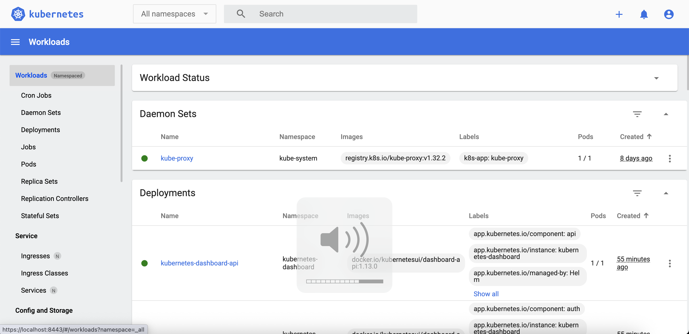

## Установка Helm chart Kubernetes Dashboard

https://github.com/kubernetes/dashboard/tree/master/charts/kubernetes-dashboard

(1)

```bash
# добавление Helm-репозитория
helm repo add kubernetes-dashboard https://kubernetes.github.io/dashboard/

helm repo update

# установка Dashboard в кластер
# в моем случае в локальный кластер Docker Desktop
helm upgrade --install kubernetes-dashboard kubernetes-dashboard/kubernetes-dashboard \
  --create-namespace \
  --namespace kubernetes-dashboard

kubectl get pods -n kubernetes-dashboard

kubectl -n kubernetes-dashboard port-forward svc/kubernetes-dashboard-kong-proxy 8443:443

```

(2)
Создание ServiceAccount и токена – см `./dashboard-adminuser.yaml`

(3)

```bash
kubectl apply -f dashboard-adminuser.yaml

# получение токена
kubectl -n kubernetes-dashboard get secret admin-user \
  -o go-template='{{ .data.token | base64decode }}'
```

(4)
Переходим в web-интерфейс https://localhost:8443, полученный bearer-token используем для вход



### Источники:

- https://github.com/kubernetes/dashboard/tree/master/charts/kubernetes-dashboard
- https://github.com/kubernetes/dashboard/blob/master/docs/user/access-control/README.md
- https://github.com/kubernetes/dashboard/blob/master/docs/user/access-control/creating-sample-user.md
